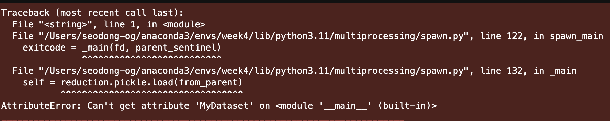
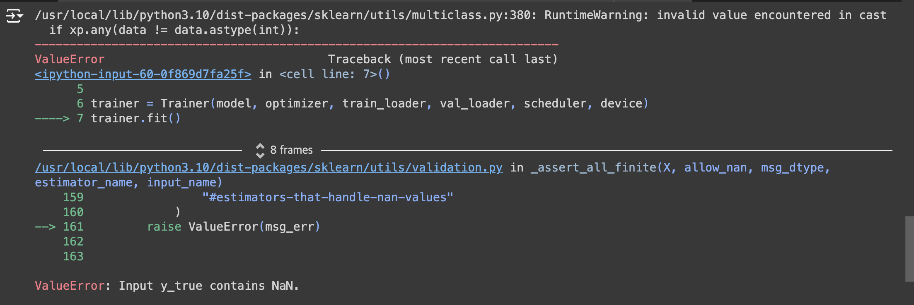

## 사용한 모듈 분석

```python
import random
import pandas as pd
import numpy as np
import os
import torch
import torch.nn as nn
import torch.optim as optim
import torch.nn.functional as F
from torch.utils.data import Dataset, DataLoader
from tqdm.auto import tqdm
from sklearn.metrics import f1_score
```

- os: 현재 파이썬 파일 외의 파일 호출용

```python
os.listdir():현재 위치의 파일들 확인(리스트 타입으로)
```

- torch.nn: 신경망 생성
  신경망은 데이터에 대한 연산을 수행하는 계층(layer)/모듈(module)로 구성되어 있음.

- torch.optim: PyTorch에서 제공하는 최적화(optimizer) 알고리즘을 포함하는 모듈.
  자세한 내용: https://wikidocs.net/194971

- torch.nn.functional
  torch.nn 과 torch.nn.functional의 차이점은 클래스, 함수의 차이.(동작은 동일)
  functional는 바로 값을 받을 수 있음

- torch.utils.data: 사용자가 자신의 데이터셋을 만들어 Pytorch에서 사용할 수 있도록 함.

- **tqdm.auto** 사용자의 코드 실행 환경을 자동으로 탐지하여 tqdm.notebook이나 tqdm.std(기본값)을 알아서 설정

- sklearn.metrics:
  정밀도와 재현율의 가중조화평균(weight harmonic average)을 F점수(F-score)라고 함.
  이 F점수를 구하는 함수.

## 코드 리뷰

- 변수 device는 무슨 뜻일까?

```python
device = torch.device('cuda') if torch.cuda.is_available() else torch.device('cpu')
```

torch.device('cuda'): 현재 CUDA(Compute Unified Device Architecture) GPU로 설정 **CUDA는 NVIDIA의 GPU를 위한 병렬 컴퓨팅 플랫폼이자 프로그래밍 모델입.**
if torch.cuda.is_available() : 만약 torch의 cuba가 사용가능 하다면. pass
else: torch.device('cpu'): device를 cpu로 바꿔라

실제 공모전에서는 코랩을 사용해야함(cpu <<< cuda)

가능한 경우 GPU 또는 MPS와 같은 하드웨어 가속기에서 모델을 학습하려고 합니다

```python
device = (
    "cuda"
    if torch.cuda.is_available()
    else "mps"
    if torch.backends.mps.is_available()
    else "cpu"
```

- class를 왜 사용했을까?

```python
  class AutoEncoder(nn.Module):
    def __init__(self):
        super(AutoEncoder, self).__init__()
        self.Encoder = nn.Sequential(
            nn.Linear(30,64),
            nn.BatchNorm1d(64),
            nn.LeakyReLU(),
            nn.Linear(64,128),
            nn.BatchNorm1d(128),
            nn.LeakyReLU(),
        )
        self.Decoder = nn.Sequential(
            nn.Linear(128,64),
            nn.BatchNorm1d(64),
            nn.LeakyReLU(),
            nn.Linear(64,30),
        )

    def forward(self, x):
        x = self.Encoder(x)
        x = self.Decoder(x)
        return x
```

nn.module: PyTorch에서 모든 신경망 모듈의 기본 클래스

`self.Encoder`는 입력 데이터를 인코딩하는 역할을 함

- `nn.Sequential`은 여러 층을 순차적으로 쌓는 방법
- `nn.Linear(30, 64)`는 입력 차원이 30이고 출력 차원이 64인 완전 연결 층
- `nn.BatchNorm1d(64)`는 배치 정규화 층으로, 64차원의 출력을 정규화
- `nn.LeakyReLU()`는 Leaky ReLU 활성화 함수로, 음수 영역에서도 작은 기울기를 갖는 ReLU 변형
- 같은 구조가 반복되어, 최종적으로 입력 데이터가 128차원으로 변환됩니다.

`self.Decoder`는 인코딩된 데이터를 원래 차원으로 복원하는 역할

- `nn.Linear(128, 64)`는 입력 차원이 128이고 출력 차원이 64인 완전 연결 층
- `nn.BatchNorm1d(64)`와 `nn.LeakyReLU()`는 인코더와 동일한 역할
- `nn.Linear(64, 30)`은 최종 출력 차원이 30인 완전 연결 층으로, 원래의 입력 차원으로 복원

`forward` 는 입력 데이터 `x`를 받아 인코더를 통해 인코딩하고, 디코더를 통해 디코딩하여 최종 출력을 반환

- 입력 데이터 `x`는 먼저 `self.Encoder`를 통해 변환된 후, `self.Decoder`를 통해 원래 차원으로 복원됩니다.

```python

def validation(self, eval_model, thr):

	cos = nn.CosineSimilarity(dim=1, eps=1e-6)
	eval_model.eval()
	pred = []
	true = []

	with torch.no_grad():

	for x, y in iter(self.val_loader):

		x = x.float().to(self.device)
		_x = self.model(x)

		# NaN 값 확인
		if torch.isnan(x).any() or torch.isnan(_x).any():
			print("NaN detected in input or model output")
			continue

		diff = cos(x, _x).cpu().tolist()

		# NaN 값 확인
		if any(np.isnan(diff)):
			print("NaN detected in cosine similarity output")
			continue

		batch_pred = np.where(np.array(diff) < thr, 1, 0).tolist()
		pred += batch_pred
		true += y.tolist()
		return f1_score(true, pred, average='macro')
```

NaN 체크이유: 아래 2번째 에러 발생으로 인해서 NaN값 확인이 필요함
=> 계속 Epoch : [회차] Train loss : [nan] Val Score : [nan])가 발생함. => **커널 재시작 => 해결**

nn.CosineSimilarity(): 코사인 유사성을 반환,
입력값 - x1: 입력값 1 - x2: 입력값 2 - dim: 코사인 유사성이 계산되는 차원 - eps: 차원이 0이되지 않도록 하는 값

모델 fit 시간 기록: 35분

## 나온 에러

- 
  멀티프로세싱을 하도록 쓰레드를 여러 개 만드는데 **환경**에 따라 오류가 발생
  => 코랩으로 돌려야 해결됨


torch.isnan(x).any() or torch.isnan(_x_).any() 에서 NaN값이 발생함
=> NaN체크해서 continue로 탈출함.
